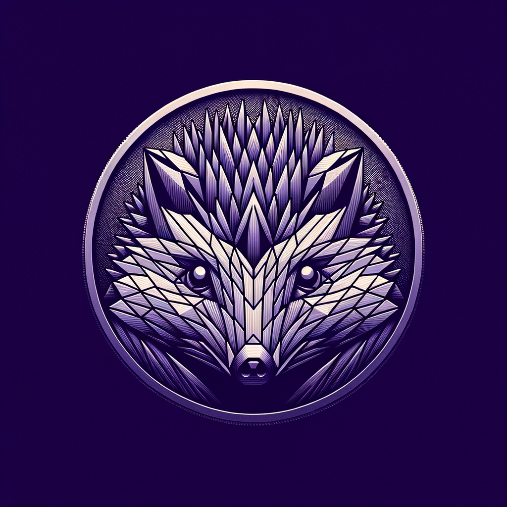
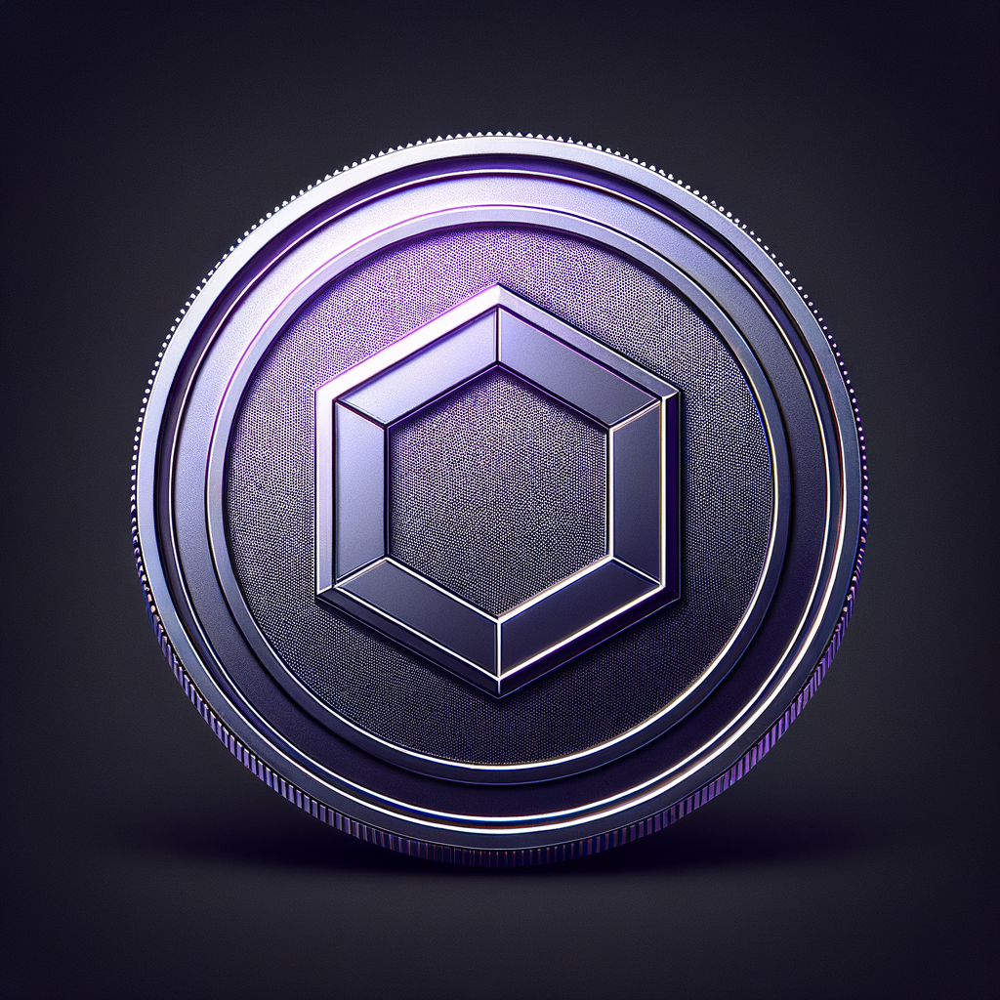

# Prompts used for generating images

**Original**:
Create a coin, use monochromatic colors based on violet, the coin surface perfectly smooth and polished like a mirror, the coin face has a polygon shape resembling an hedgehog head drawn with a thick line

**Revised**:
Generate a monochromatic image largely based on shades of violet. The central focus of the image is a coin with a perfectly smooth and highly polished surface that mirrors its surroundings. The face of the coin features a unique polygon shape that closely resembles the head of a hedgehog, with the detail being captured using a thick and bold line. All elements of the image should exude a modern and minimalist aesthetic.

**Original**:
Create a coin, use monochromatic colors based on violet, the coin surface perfectly smooth and polished like a mirror, the coin face has an hexagon shape drawn with a thick line, the coin is over a black (RGB 0, 0, 0) background

**Revised**:
reate an image of a coin with monochromatic colors varying around violet. The coin's surface should be perfectly smooth and polished to a mirror-like finish. On the coin's face, there should be an hexagon shape, depicted with a thick line. The coin should be placed over a background that is pure black (RGB 0, 0, 0). Please note, that the coin has a metallic luster which reflects the surrounding environment.
